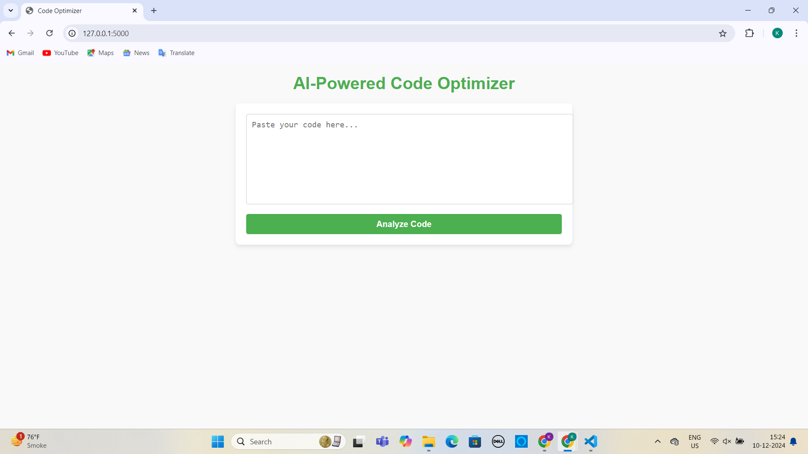
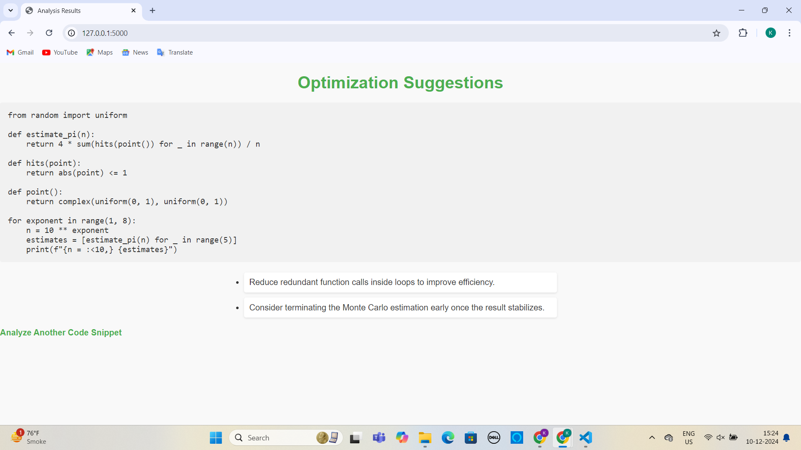

# AI-based-code-optimizer

## How to run the project

### Clone the repository
### Create virtual environment
### Install dependencies
#### pip install -r requirements.txt
### Run the Flask app
#### Command : flask run or python app.py

## Design Choices
#### Flask Framework: Chosen for its simplicity and ease of use for small projects.
#### Rule-based System: Code optimizations are provided based on predefined performance rules (e.g., redundant loops, inefficient function calls).
#### Frontend: Simple HTML with Flask templates to display the input form and results.
## Assumptions and Limitations
### Assumptions:
#### The tool works only for Python code.
#### Code is submitted as plain text.
### Limitations:
#### The analysis is static; no real-time profiling is done.
#### Suggestions may not apply to all use cases.

## Screenshots

### Homepage

### Results Page

